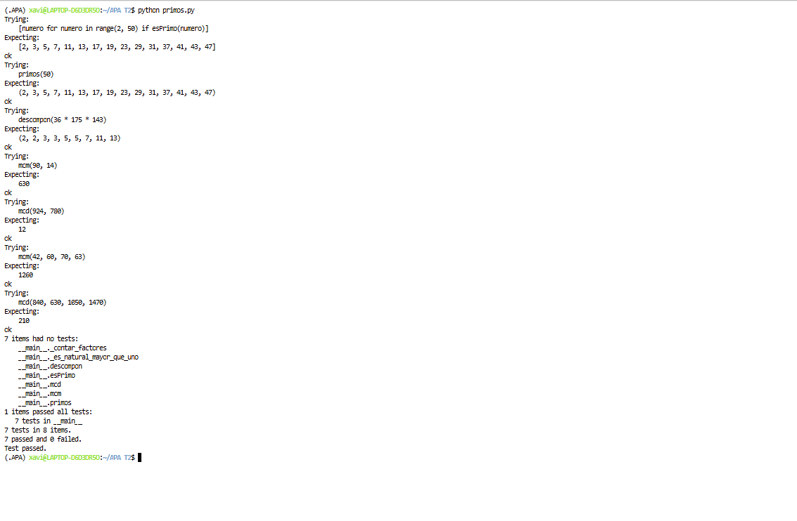

# Tercera tarea de APA: Multiplicación de vectores y ortogonalidad

## Nom i cognoms

> [!Important]
> Introduzca a continuación su nombre y apellidos:
>
> Xavi Prats Castillo

## Aviso Importante

> [!Caution]
>
> El objetivo de esta tarea es programar en Python usando el paradigma de la programación
> orientada a objeto. Es el alumno quien debe realizar esta programación. Existen bibliotecas
> que, sin lugar a dudas, lo harán mejor que él, pero su uso está prohibido.
>
> ¿Quiere saber más?, consulte con el profesorado.

## Fecha de entrega: 6 de abril a medianoche

---

## Clase Vector e implementación de la multiplicación de vectores

El fichero `algebra/vectores.py` incluye la definición de la clase `Vector` con los
métodos desarrollados en clase, que incluyen la construcción, representación y
adición de vectores, entre otros.

Se han añadido los métodos requeridos junto con sus tests unitarios.

---

## Ejecución de los tests unitarios

Inserte a continuación una captura de pantalla que muestre el resultado de ejecutar el
fichero `algebra/vectores.py` con la opción *verbosa*, de manera que se muestre el
resultado de la ejecución de los tests unitarios.



---

## Código desarrollado

```python
"""
Tercera tarea de APA: Multiplicación de vectores y ortogonalidad

Nombre y apellidos: Xavi Prats Castillo

Tests unitarios
===============

>>> v1 = Vector([1, 2, 3])
>>> v2 = Vector([4, 5, 6])
>>> v1 * 2
Vector([2, 4, 6])
>>> v1 * v2
Vector([4, 10, 18])
>>> 2 * v1
Vector([2, 4, 6])
>>> v1 @ v2
32

>>> v1 = Vector([2, 1, 2])
>>> v2 = Vector([0.5, 1, 0.5])
>>> v1 // v2
Vector([1.0, 2.0, 1.0])
>>> v1 % v2
Vector([1.0, -1.0, 1.0])
>>> v1 // v2 + v1 % v2
Vector([2.0, 1.0, 2.0])
"""

import doctest


class Vector:
    def __init__(self, componentes):
        self.componentes = list(componentes)

    def __repr__(self):
        return f"Vector({self.componentes})"

    def __eq__(self, other):
        return isinstance(other, Vector) and self.componentes == other.componentes

    def __len__(self):
        return len(self.componentes)

    def __add__(self, other):
        return Vector([a + b for a, b in zip(self.componentes, other.componentes)])

    def __sub__(self, other):
        return Vector([a - b for a, b in zip(self.componentes, other.componentes)])

    def __mul__(self, other):
        if isinstance(other, (int, float)):
            return Vector([x * other for x in self.componentes])
        if isinstance(other, Vector):
            return Vector([a * b for a, b in zip(self.componentes, other.componentes)])
        raise TypeError

    def __rmul__(self, other):
        return self * other

    def __matmul__(self, other):
        return sum(a * b for a, b in zip(self.componentes, other.componentes))

    def __floordiv__(self, other):
        escalar = (self @ other) / (other @ other)
        return other * escalar

    def __mod__(self, other):
        return self - (self // other)


if __name__ == "__main__":
    doctest.testmod(verbose=True)


    ```bash